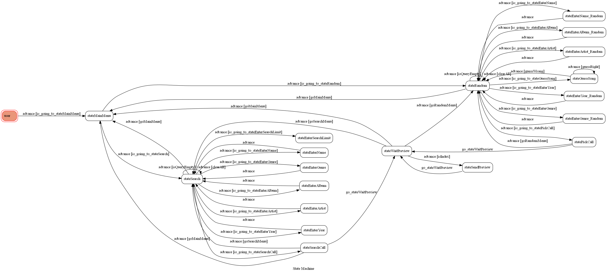
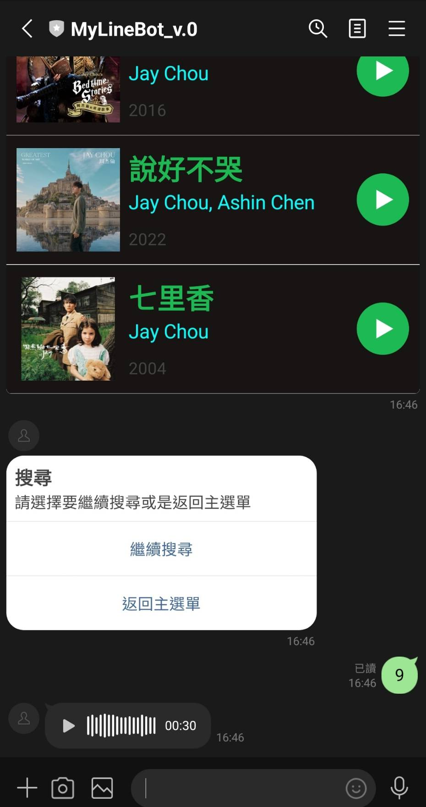
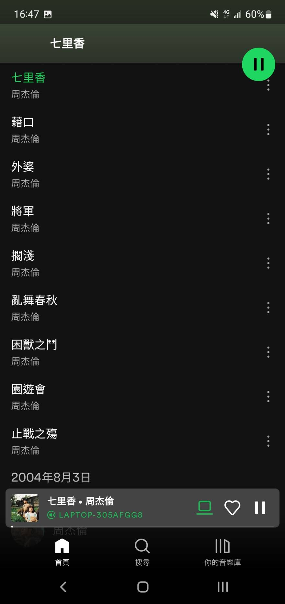
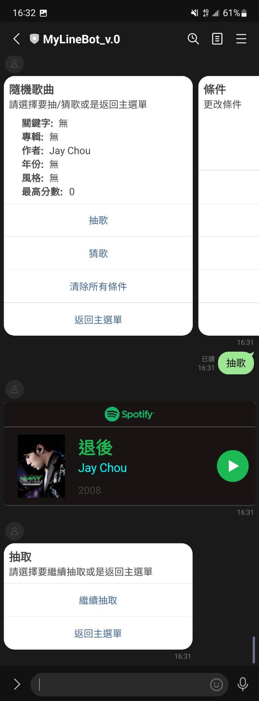

# Spotify Line bot

* A Line bot with Spotify API, Spotipy


## FSM graph



## Features

### Condition setting

give conditions while using the search, pick, guess features


### Search song 


* Result List

search the song with given condition, return a list of results


Search result

* Preview the song

Click the play button gives you a 30s preview audio file



Click the image redirect you to the Spotify App



### Pick

Pick a random song of up to 1000 searched results, instead of giving the list of top 10 results



### Guess
A little game of guessing song


* Some process on string matching

    Use difflib.SequenceMatcher to get ratio of matched string, above 0.9 is acceptable
    
```python = 170
def checkAnswer(text):
    text = re.sub(r'Version|Ver|ver|Live|[\(\)\ \']', '', text)
    ans = re.sub(r'Version|Ver|ver|Live|[\(\)\ \']', '', stateGuessSong_songName)
    text = text.lower()
    ans = ans.lower()
    seq = difflib.SequenceMatcher(None, text, ans)
    ratio = seq.ratio()
    seq = seq.find_longest_match(0, len(text), 0, len(ans))
    isAnswer = ratio>=0.9 or (ratio>=0.65 and seq.size == len(text) and seq.b == 0)
    if isAnswer:
        return True
    else:
        return False
```

## Reference

[Spotipy](https://spotipy.readthedocs.io/en/2.21.0/#)

[Flex Message Simulator](https://developers.line.biz/flex-simulator/)


